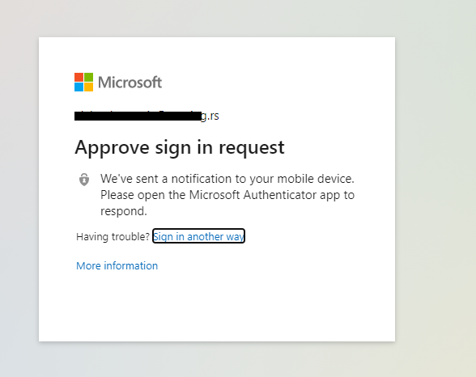

# vCloud SAML autentifikacija sa Azure AD-om za eksterne korisnike COMING

U nastavku je opisan proces konfiguracije Azure-a i vCloud direktora za potrebe 2FA.
U čemu će vam pomoći ovo uputstvo?

Uputstvo sadrži celokupan proces konfiguracije 2FA po koracima sa screenshot-ovima i opisima tih koraka, pa samim ponavljanjem koraka možete lako konfigurisati 2FA kroz 10-tak minuta.
</br>

__Proces ukratko:__

1. Kreiranje novog Azure tenanta
2. Kreiranje Enterprise App na Azuru
3. Podešavanje Single Sign On-a na Azuru
4. Podešavanje SAML-a na VMware Cloud Director-u
5. Podešavanje atributa i claimova aplikacije na Azuru
6. Import federation metadata u VMware Cloud Director
7. Importovanje korisnika u vCD-u i Azure
8. Testiranje funkcionalnosti

Pre nego što počnemo:

__Morate imati neku od sledećih titula na Azure-u:__

``` 
 * Global Administrator
 * Cloud Application Administrator
 * Application Administrator
 * Owner of the service principal.
```

__Morate imati sledeću titulu na VMware Cloud Director-u:__

``` 
 * Organizational Administrator
```
----------------------------
----------------------------

##  __Kreiranje Azure tenanta__

 Kao početni korak, ulogovaćemo se na [Azure portal](https://portal.azure.com). </br>
</br>


 Nakon logovanja, ulazimo u Azure Active directory gde dobijamo mogućnost kreiranja novog tenanta. </br>


Nakon toga pojavljuje se prozor:


kao i prozor:


Kada popunimo sve podatke, kreiramo tenant na dugme __Review + Create__.
Potrebno je oko 1 minut da se kreira novi tenant, i imaćemo link za pristup našem novom tenantu.

Nakon pristupa, prozor se prebacuje na novi tenant.
Potrebno je dodati novog korisnika, to radimo tako sto kliknemo na dugme __Users__.
</br>


U okviru Users taba, kliknemo na dugme __New Guest User__.
</br>


Nakon što popunimo sva polja za novog korisnika, pozivamo ga klikom na dugme invite.
Nakon ovog koraka, korisnik mora da prihvati link na svom mail nalogu. 

------------------
-----------------
## Konfigurisanje naloga sa korisničke strane

Invite je stigao u korisnički mailbox. 
</br>


Kada korisnik prihvati link koji smo mu poslali, mora da kreira nalog. Microsoft će mu proslediti niz formi koje treba da popuni da bi se verifikovao. 
</br>


Klikom na dugme __Create one!__ pokrećemo taj wizard.
</br>


</br>

Nakon ovog prozora pojavljuje se sledeći gde korisnik mora da kreira password.

</br>

Nakon unošenja ovih podataka, stići će mail sa verifikacionim kodom.


</br>
Unos koda iz mailboxa:


</br>
Nakon unosa koda, Microsoft nas šalje na stranicu uspešnosti logovanja.


Nakon ovog koraka, vraćamo se Azuru i kreiranju aplikacije.

##  __Kreiranje Enterprise aplikacije na Azuru__

 Ako se Enterprise aplikacija ne pojavi na početnom ekranu, možemo je pretražiti u Search bar-u.</br>
 Kreiramo novu aplikaciju za naše potrebe klikom na dugme New Application, slika ispod.


Na sledećem prozoru je potreno odabrati kreiranje nove aplikacije, zatim moramo joj zadati ime i izabrati opciju (Non-Gallery). Uputstvo na slici ispod.


Nakon kreiranja aplikacije, pojaviće se prozor sa aplikacijom. Klikom na Single sign on prelazimo na podešavanja SAML-a.</br>


Prelazimo na prozor gde biramo način autentifikacije, biramo SAML.
</br>


Otvoriće nam se prozor sa podešavanjima atributa i claim-ova.

## Nakon ovog koraka prelazimo na podešavanje SAML-a na VMware Cloud Director-u

* Biramo adresu našeg tenanta, i odlazimo na tab __Applications__. </br>
* Biramo sa leve  strane meni  __Identity Providers__ i pronalazimo __SAML__ podešavanje.</br>
* Kopiramo __Metadata__ link i kliknemo iznad dugme  __Edit__. </br>
Podešavanje po koracima na slici ispod.


Otvoriće se Edit SAML Configuration prozor, i prazno polje Entity ID u koje ćemo nalepiti link koji smo iskopirali na prethodnom koraku i snimiti.


## Nakon ovog koraka vraćamo se na podešavanje SAML-a na Azuru.

Sada podešavamo SAML metadata na Azuru.
1. Kliknemo na dugme __Upload metadata file__.
2. Zatim kliknemo __Select a file__. 
    </br>Pojaviće se prozor u kom možemo da dodamo link.
3. Nalepimo link koji smo prethodno iskopirali sa VMware Cloud Director-a. 
4. Sačuvamo link koji smo nalepili.
5. Kliknemo __Add__ dugme.
</br>


Nakon petog koraka, pojaviće se prozor, potrebno je kliknuti __Save__ dugme.


Potrajaće proces nekih 5-10 sekundi, nakon toga videćemo da su se neki podaci promenili: Identifier, Reply URL i Logout URL.

## Podešavanje User attributes and claims u aplikaciji na Azuru

Potrebno je promeniti polje __User Attributes and Claims__, uputstvo na slici ispod.


Nakon klika na __Edit__ dugme, otvoriće nam se podešavanje ovog polja.
</br>

Kliknemo na dugme __Add new claim__. </br>


Otvoriće se prozor u koji možemo da dodamo atribute i claimove.


Potrebno je kreirati 2 claima, Username i Roles. </br>
Podaci koji treba da se unesu u prvi claim su:
</br>

```
Username 

Name:              Username   
Namespace:         https://schemas.xmlsoap.org/ws/2005/05/identity/claims/UserName/Username
Source Attribute:  user.mail
```

Nakon dodavanja ovih podataka potrebno je snimiti ovaj claim i ponoviti identične operacije sa podacima ispod.

```
Roles 

Name:              Roles   
Namespace:         http://schemas.xmlsoap.org/ws/2005/05/Roles
Source Attribute:  user.assignedroles
```

# RAZLIKA KOD EKSTERNIH KORISNIKA
   Moramo izmeniti Claim __Unique User Indentifier (Name ID)__.  

   Ovo je bitno jer kada invite-ujemo korisnike, drugačiji user principal name nam kreira AAD u odnosu na dodavanje korisnika ručno na AAD.

   Ono što treba izmeniti: 
   Setovati Source atribut na __user.mail__.


        
------------------------
Nakon kreiranja i izmene claimova, vraćamo se na __Single Sign On__ stranicu naše aplikacije.</br>
Pojaviće se prozor koji izgleda kao na slici ispod.


Nakon download-ovanja Federation Metadata, vraćamo se na VMware Cloud Director.</br>
 
 ## Importovanje Federation Metadata u vCloud Direktor.
Potrebno je nalepiti te podatke u Identity provider.
</br>
Vraćamo se u prozor gde smo nalepili link od Identity providera.</br>
__To radimo tako što biramo Edit opciju u SAML Configuration prozoru__


Nakon toga biramo tab __Identity Provider__.
</br>
* Uključujemo __Use SAML Identity Provision:__.
* Kliknemo __Browse__ dugme.
* Nadjemo downloadovani xml file (u prethodnom koraku smo sa azura skinuli fajl).
* Uploadujemo ga na vCloud Direktor.
* Snimimo podešavanje. 
  


Nakon ovog koraka, uspešno smo kreirali 2FA na VMware Cloud Direktoru.

-----------------------------------------
-----------------------------------------
## Importovanje korisnika u Azure i vCloud direktor

Ono što nam preostaje je da dodamo korisnike u našu aplikaciju da bismo imali mogućnost logovanja na vCD.
</br>
Prvo ćemo dodati korisnika u aplikaciju na Azure-u.</br>
Potrebno je da odemo na stranicu aplikacije koju smo kreirali i da izaberemo polje __Users and Groups__.</br>
Nakon toga kliknem,o dugme __Add User/Group__.</br>  


Otvara nam se prozor u kom možemo da izaberemo korisnika i dodamo ga u aplikaciju.
</br>


Nakon ovog koraka, istog korisnika moramo da importujemo u vCloud Direktor.
To radimo tako što odemo na stranicu __Applications__ i biramo __Users__ tab na vCD-u, i biramo dugme __Import User__.</br>


Pojavljuje nam se prozor u kom možemo da unesemo email adresu i da odaberemo ulogu tog korisnika na našem vCD-u.
</br>


Kada snimimo našeg korisnika (koji je identičan kao naš korisnika na aplikaciji u Azuru), završili smo celokupan proces konfigracije. Sada možemo da testiramo funkcionalnost. Možemo da se izlogujemo sa vCD-a i da probamo ponovo da se ulogujemo.

----------------------------------------
----------------------------------------
## Pre nego što testiramo našu 2FA za eksterne korisnike

Moramo podesiti __MultiFactor Authentication__ na strani Azure-a za korisnike. 
To radimo tako što odemo na:
 </br>   1. Azure Active Directory
    </br>2. Users
    </br>3. U gornjem meniju biramo __Multifactor Authentication__
    </br>4. Nakon toga otvara nam se prozor sa konfiguracijom Multi faktorske autentifikacije za korisnike

Koraci 3 i 4 na slikama ispod:


Nakon ovih podešavanja, korisnik će imati dvofaktorsku autentifikaciju.

---------------------------------------
---------------------------------------
## Testiranje 2FA, Logovanje na VMware Cloud Director

Kada se izlogujemo sa našeg naloga, vCD će nam vratiti sledeću stranicu.

Biramo __Login with Single Sign On__.


Aplikacija nam vraća login koji je podešen za korisnika na Azuru.</br>


</br>Aplikacija zahteva drugi faktor, što je u ovom slučaju aplikacija Microsoft Authenticator.</br>



</br>
I nakon uspešnog logovanja, dolazimo do novog prozora vCD-a, gde smo ulogovani sa novim korisnikom uz pomoć 2FA.
</br>
</br>


Ono što se može razlikovati je način multi-faktorske autentifikacije koja je postavljena na Azure-u. Može da bude i password, ne mora da bude Microsoft aplikacija. 

  ##                *Thats all folks!*